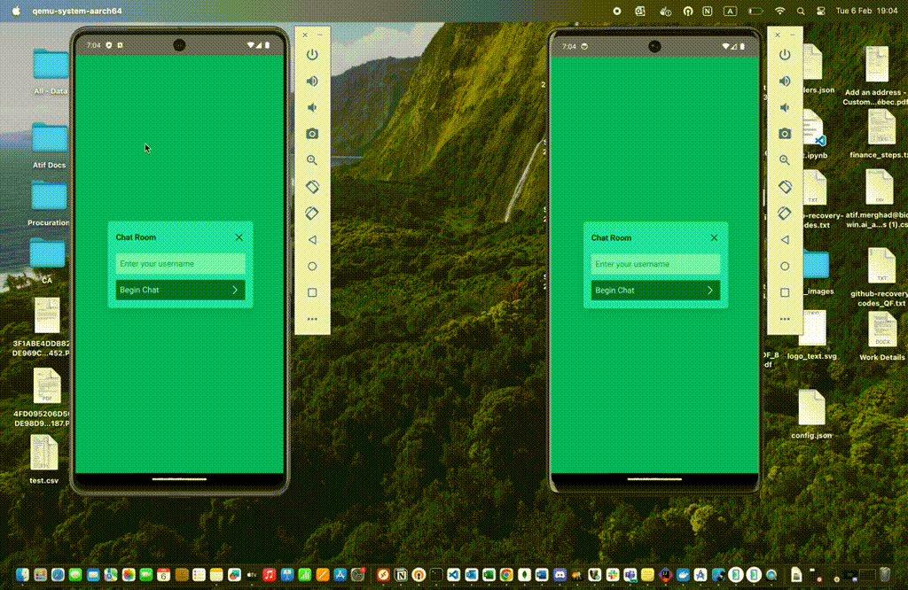

# Kafka Chat Application

This project consists of two main components: a backend service built with Spring Boot called `kafka-chat-be`, and a frontend application developed using React.js called `kafka-chat-fe`. Additionally, it utilizes Kafka as a messaging system and Docker Compose for managing the Confluent platform.

## Demo 
A demo of the Kafka Chat Application



## Components:

1. **kafka-chat-be:**
   - This is the backend service developed using Spring Boot.
   - It provides APIs for handling chat functionalities.

2. **kafka-chat-fe:**
   - This is the frontend application developed using React.js.
   - It provides a user interface for interacting with the chat system.

## Dependencies:

- **Kafka:**
  - Kafka is used as a messaging system for real-time communication between clients.

- **Docker Compose:**
  - Docker Compose is used to manage the Confluent platform, which includes Kafka, Zookeeper, and other necessary services.

## Getting Started:

1. **Setting up Kafka:**
   - Ensure Docker and Docker Compose are installed.
   - Run `docker-compose up` to start the Confluent platform.

2. **Starting Backend:**
   - Navigate to the `kafka-chat-be` directory.
   - Run the Spring Boot application using your preferred IDE or by executing `./mvnw spring-boot:run`.

3. **Starting Frontend:**
   - Navigate to the `kafka-chat-fe` directory.
   - Install dependencies using `npm install` or `yarn install`.
   - Start the React application using `npm start` or `yarn start`.

4. **Accessing the Application:**
   - Once both backend and frontend are running, access the application at `http://localhost:3000` in your web browser.

## Capacitor Mobile App:

- To generate a mobile app from the React.js app, follow these steps:
  1. Install Capacitor CLI and core by running:
     ```
     npm install @capacitor/cli @capacitor/core
     ```
  2. Initialize Capacitor project by running:
     ```
     npx cap init
     ```
  3. Install iOS and Android platforms by running:
     ```
     npm install @capacitor/ios @capacitor/android
     ```
  4. Add iOS platform by running:
     ```
     npx cap add ios
     ```
  5. Add Android platform by running:
     ```
     npx cap add android
     ```

- After adding the platforms, you can continue with further development and customization of the mobile app using Capacitor.

## Contributing:

Contributions are welcome! If you'd like to contribute to this project, please fork the repository and submit a pull request.

## License:

This project is licensed under the [MIT License](LICENSE).
